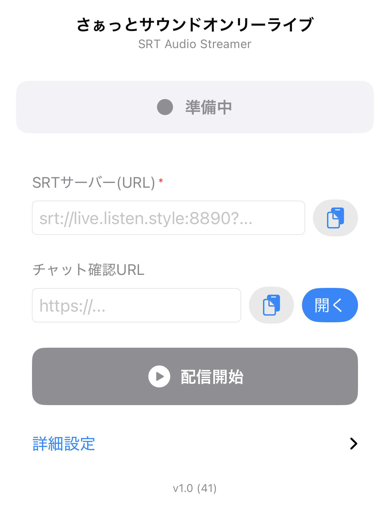

# さぁっと (SRT Audio Streamer)

[LISTEN](https://listen.style/) へ音声をSRT（Secure Reliable Transport）プロトコルでライブ配信するiOSアプリです。

## スクリーンショット



## 特徴

- 🎙️ マイク音声のリアルタイム配信
- 🔒 SRTプロトコルによる信頼性の高い伝送
- ⚡ 低レイテンシー配信（デフォルト120ms）
- 📊 リアルタイムビットレート表示
- 🎚️ ビットレート選択（64/96/128 kbps）
- 💬 LISTENのチャット画面をアプリ内ブラウザで表示（配信開始時に自動オープン）
- 🔄 接続切断時の自動再接続
- 📱 iOS 17.0以上対応
- 🎨 シンプルで使いやすいUI

## LISTENでの使い方

[LISTEN](https://listen.style/) はポッドキャスト・音声配信プラットフォームです。このアプリはLISTENのSRTライブ配信に特化して設計されています。

### 配信手順

1. LISTENにログインし、ライブ配信の設定からSRT URLを取得する
   - SRT URLの形式: `srt://live.listen.style:8890?streamid=...`
2. アプリを起動し、取得したSRT URLを入力する
3. 「配信開始」をタップすると配信が始まり、チャット画面が自動で開く

## 必要環境

- Xcode 15.0以上
- iOS 17.0以上
- Swift 5.0以上

## セットアップ

### 1. リポジトリをクローン

```bash
git clone https://github.com/haya256/srtto-sound-only-live.git
cd srtto-sound-only-live
```

### 2. プロジェクトを開く

```bash
open SRTAudioStreamer.xcodeproj
```

### 3. 依存関係の解決

Xcodeでプロジェクトを開くと、Swift Package Managerが自動的に依存関係をダウンロードします。

- **SRTHaishinKit.swift** (v2.0.0以上): SRTストリーミング機能を提供

### 4. ビルドと実行

1. Xcodeでターゲットデバイスを選択（実デバイス推奨）
2. Product > Run (⌘R) でアプリをビルド・実行

## プロジェクト構成

```
SRTAudioStreamer/
├── SRTAudioStreamerApp.swift          # アプリエントリーポイント
├── Models/
│   ├── StreamConfiguration.swift      # SRT設定モデル
│   └── StreamState.swift              # 配信状態の定義
├── ViewModels/
│   └── StreamViewModel.swift          # ビジネスロジック・状態管理
├── Views/
│   ├── ContentView.swift              # メイン画面
│   ├── StreamControlView.swift        # 配信コントロールUI
│   └── StreamStatusView.swift         # 状態表示UI
├── Services/
│   └── SRTStreamingService.swift      # SRTストリーミングロジック
└── Utilities/
    └── AudioSessionManager.swift      # AVAudioSession管理
```

## アプリの操作方法

### 1. 初回設定

1. アプリを起動
2. 初回起動時、マイク権限を許可
3. LISTENから取得したSRT URLを入力する

### 2. 配信の開始

「配信開始」ボタンをタップすると:
- SRTサーバーへ接続し、音声配信が始まる
- チャット確認画面がアプリ内ブラウザで自動的に開く（URLが空欄の場合は `https://listen.style/` が開く）

### 3. 配信の停止

「配信停止」ボタンをタップして配信を終了します。

## 状態遷移

```
待機中 → 接続中 → 配信中 → 切断中 → 待機中
  ↓                     ↓
エラー ←-----------------┘
```

## 機能説明

### 配信状態インジケーター

- **グレー（待機中）**: 配信待機状態
- **オレンジ（接続中）**: サーバーに接続中
- **グリーン（配信中）**: 正常に配信中
- **レッド（エラー）**: エラー発生

### ビットレート選択

3つのプリセットから選択可能:
- **64 kbps**: 標準品質（推奨）
- **96 kbps**: 高品質
- **128 kbps**: 最高品質

### リアルタイム監視

配信中は1秒ごとにビットレートが更新表示されます。

## トラブルシューティング

### 接続できない

1. SRTのアドレスが間違っていないか確認する

### 音声が届かない

1. マイク権限が許可されているか確認
   - 設定 → プライバシーとセキュリティ → マイク
2. アプリの配信状態が「配信中」になっているか確認
3. iPhoneのマイクが正常に動作しているか確認
4. ビットレート表示が更新されているか確認

### エラーメッセージ

- **マイクへのアクセスが許可されていません**: 設定アプリでマイク権限を許可
- **無効なSRT URLです**: URLが `srt://` で始まることを確認
- **オーディオデバイスが見つかりません**: アプリを再起動
- **接続に失敗しました**: サーバー設定とネットワーク接続を確認

## アーキテクチャ

### MVVMパターン

- **Model**: `StreamState`, `StreamConfiguration` - データモデル
- **View**: `ContentView`, `StreamControlView`, `StreamStatusView` - UI
- **ViewModel**: `StreamViewModel` - ビジネスロジックと状態管理

### レイヤー構造

1. **Views**: ユーザーインターフェース
2. **ViewModels**: プレゼンテーションロジック
3. **Services**: SRTストリーミングロジック
4. **Utilities**: 共通ユーティリティ（オーディオセッション管理）
5. **Models**: データモデル

## 技術スタック

- **言語**: Swift 5.0
- **フレームワーク**: SwiftUI, AVFoundation, Combine
- **ライブラリ**: SRTHaishinKit.swift
- **プロトコル**: SRT (Secure Reliable Transport)
- **音声処理**: AVAudioSession, AVCaptureDevice
- **ログ**: OSLog (os.log)

## ライセンス

このプロジェクトはMITライセンスの下で公開されています。詳細は[LICENSE](LICENSE)ファイルを参照してください。

### 依存ライブラリ

このプロジェクトは以下のオープンソースライブラリを使用しています:

- **[HaishinKit.swift](https://github.com/shogo4405/HaishinKit.swift)** - BSD 3-Clause License
  - SRTストリーミング機能を提供

各ライブラリのライセンスについては、それぞれのリポジトリを参照してください。

